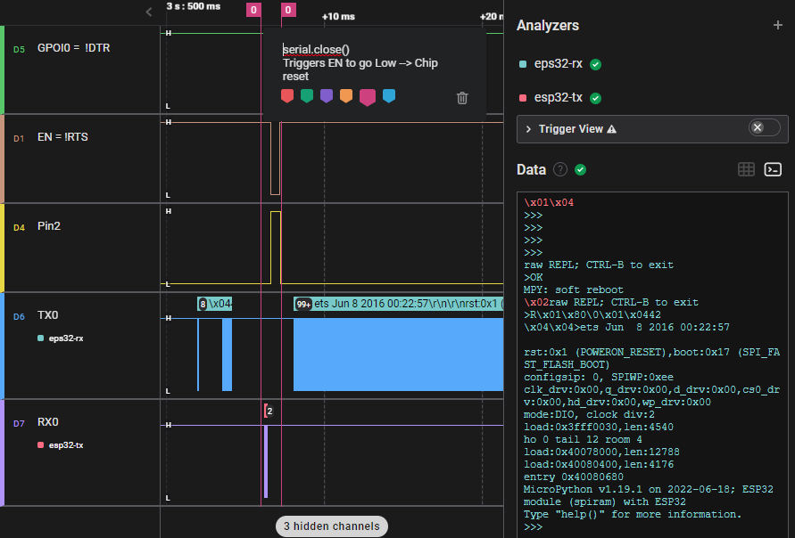
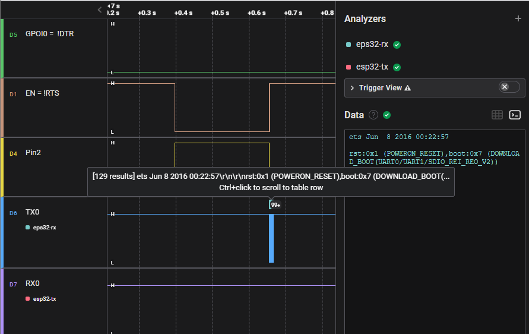

# pyboard: 
# pyboard: ESPxxx boards hang in firmware bootloader after hardware reset via button  


The bug exposes itself in MPRemote: ( using a current, but unpublished version) 


Repro: 
 - connect an ESPxxx device ( ESP8266, ESP32 ,ESP32S3 )   
 - `mpremote repl'` 
 - press the hardware reset button, or briefly pull down EN (Enable) to reset the MCU
 - `mpremote` shows that the board has reset and entered the boot loader.
   The exact message will differ per board : [boot loader messages](https://docs.espressif.com/projects/esptool/en/latest/esp32/advanced-topics/boot-mode-selection.html#boot-mode-message)


The previous [PR #10347](https://github.com/micropython/micropython/pull/10347) did solve the hard-reset on disconnect, 
but creates a new issue that the board hangs in the bootloader after a reset using a hardware reset button .

This secondary issue is caused by the fact that the ESPxxx boards uses the DTR signal to set the boot-mode of ESPxx boards 
[boot mode selection](https://docs.espressif.com/projects/esptool/en/latest/esp32/advanced-topics/boot-mode-selection.html?highlight=GPIO0)

While this can be solved for the ESP family - this same configuration would break the repl for other boards 
I also looked at other options cts/dtr related - but I could not find a single configuration that works for all micropython ports on Windows 
However is possible to distinguish the ESPxx boards from other boards using [PortInfo](https://pyserial.readthedocs.io/en/latest/tools.html#serial.tools.list_ports.ListPortInfo)by the `manufacturer` or the `description`, and set the signals only for the ESP boards.
 
A simple overview (for windows only) : 
DTR | CTS | ESP8266 |ESP32 | STM32 | SAMD51 | RP2040
--- | --- | --- | --- | --- | --- | --
unspecified| unspecified | ❌ Win32:Reset on disconnect |❌ Win32:Reset on disconnect |✅ OK|✅ OK|✅ OK
True| False | ❌ Win32:Hang in bootloader |❌ Win32:Hang in bootloader |✅ OK |✅ OK |✅ OK
False| False | ✅ OK |✅ OK|❌ No Repl|❌ No Repl| ❌ No Repl
True| True | ❌ Win32:Reset on disconnect | ❌ Win32:Reset on disconnect | ❌ No Repl  | ❌ No Repl | ❌ No Repl
False | True | ❌ Win32 : Reset on disconnect|❌ Win32 : Reset on disconnect| ❌ No Repl  | ❌ no Repl | ❌ No Repl
serial.manufacturer  | |wch.cn|Silicon Labs| Microsoft| Microsoft| Microsoft
 serial.description  | |USB-SERIAL CH340 |Silicon Labs CP210x USB to UART Bridge  | USB Serial Device | USB Serial Device | USB Serial Device 


### Updated Logic
The updatesd logc will only set the dtr/rts signals for boards that do not use standard Microsoft drivers( based on the manufacturer)
It would also be possible to chack agains a list of known driver manufactures (like `wch.cn` or `Silicon Labs` ) but this would require a list of known drivers for all ports.

Current: https://github.com/micropython/micropython/blob/05bb26010e4a466a82cfed179f8d8d0b406a78ca/tools/pyboard.py#L289-L295


Proposed:
``` python
                try:
                    if os.name == "nt":
                        self.serial = serial.Serial(**serial_kwargs)
                        self.serial.port = device
                        portinfo = list(serial.tools.list_ports.grep(device))  # type: ignore
                        if portinfo and portinfo[0].manufacturer != "Microsoft":
                            # ESPxx boards and ESP32 boards use RTS/CTS for flashing and boot mode selection
                            # DTR False, to avoid using the reset button will hang the MCU in bootloader mode
                            # RTS False, to prevent pulses on rts on serial.close() that would POWERON_RESET an ESPxx
                            self.serial.dtr = False  # DTR False = gpio0 High = Normal boot
                            self.serial.rts = False  # RTS False = EN High = MCU enabled
                        self.serial.open()
                    else:
                        self.serial = serial.Serial(device, **serial_kwargs)
                    break
```


serial.manufacturer   | DTR | CTS | ESP8266 |ESP32 | STM32 | SAMD51 | RP2040
--- | --- | --- | --- | --- | --- | --- | --
== "Microsoft" | unspecified| unspecified | - | - |✅ OK|✅ OK|✅ OK
!+ "Microsoft" (wch.cn,Silicon Labs)| False| False | ✅ OK |✅ OK| - | - | -
 

## ESPxx - Cause of POWERON_RESET on disconnect  
The cause of the reset is a low spike in the CTS / EN signal when the serial port is closed in pyserial.
( A quick test with `putty.exe` shows similar behaviour.)



In order to prevent tthe RTS signal should be driven to a logical High. As the RTS signal is  Inverted, this means that the `serial.rts`  should be set to `False.

``` python
self.serial.rts = False  # RTS False = EN High = MCU enabled
```

## ESPxx - Cause of DOWNLOAD_BOOT on hardware reset  

A lot of boards feature a hardware reset button to allow the board to be reset. This is also true for the ESP boards.

However if an ESP  board starts after such a hardware reset, it also checks the state of `GPIO pin 0` which is tied to the Inverted DTR signal.



serial.dtr | GPIO0 Input | Mode
 --| --- | ---
 True | Low/GND | ROM serial bootloader for esptool
 False | High/VCC | Normal execution mode

This means the for ESPxx devices `serial.dtr`  should be set to `False`.
``` python
self.serial.dtr = False  # DTR False = gpio0 High = Normal boot
```
### Drivers 

 * Silicon Labs:cp210x - https://community.silabs.com/s/article/downloading-cp210x-drivers-from-windows-update?language=en_US
 * WCH : CH340 - sparkfun site : https://learn.sparkfun.com/tutorials/how-to-install-ch340-drivers/all#drivers-if-you-need-them


I encountered a bug that caused the MCU board to hang on reset when using MPRemote with an ESP32 device. 
The cause of the bug was that the CTS and DTR signals required by ESPxx family of devices do not work with ESP32 devices. 
These signals are used to put the device into bootloader mode and reset it. 
The fix for the bug was to distinguish between ESPxx boards and other boards, and set the signals accordingly. 

This way, MPRemote can work with both types of devices without causing any issues.